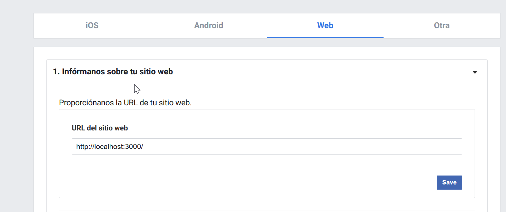
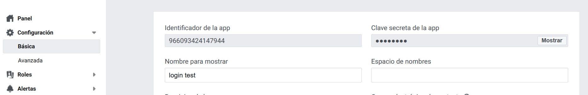
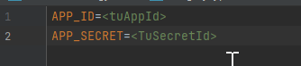
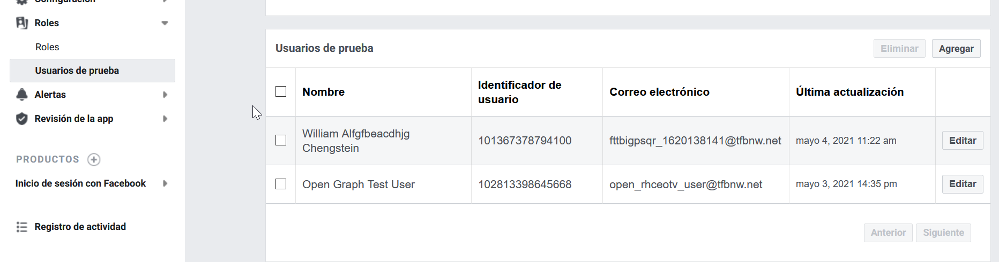

# IMPLEMENTACION LOGIN FACEBOOK

##Dependencies 

Para implementar facebook login es necesario sumar unas dependencias

    dotenv
    passport
    passport-facebook
    @nestjs/passport

####dotenv es utilizado para cargar variables y passport para manejar la autentication
yarn add dotenv @nestjs/passport passport passport-facebook
yarn add @types/passport-facebook

##Crear app de Facebook
visitar https://developers.facebook.com seleccionar crear aplicacion y llenar los campos una vez creado ir
a la pantalla principal selecciona inicio de sesion con facebook y seleccionar "configuracion", seleccionar web y
proporcionar la url en el caso de entorno local pasar http://localhost:3000/

##APP_ID y SECRET_ID
en la seccion Configuracion Basica se podran ver estos campos

luego crear un archivo .env en el directorio raiz ahi podran guardarse las credenciales

la extension .env puede agregarse a .gitignore para prevenir se agregue a git.

para agregar las variables de entorno se debe agregar en la parte de arriba abajo de los imports el siguiente codigo en el archivo main.ts

    import * as dotenv from "dotenv";

    dotenv.config();

para implementar facebook login con passport se crea el archivo facebook.strategy.ts y agregando el siguiente codigo

    import { Injectable } from "@nestjs/common";
    import { PassportStrategy } from "@nestjs/passport";
    import { Profile, Strategy } from "passport-facebook";
    
    @Injectable()
    export class FacebookStrategy extends PassportStrategy(Strategy, "facebook") {
    constructor() {
    super({
    clientID: process.env.APP_ID,
    clientSecret: process.env.APP_SECRET,
    callbackURL: "http://localhost:3000/facebook/redirect",
    scope: "email",
    profileFields: ["emails", "name"],
    });
    }
    
    async validate(
    accessToken: string,
    refreshToken: string,
    profile: Profile,
    done: (err: any, user: any, info?: any) => void
    ): Promise<any> {
    const { name, emails } = profile;
    const user = {
    email: emails[0].value,
    firstName: name.givenName,
    lastName: name.familyName,
    };
    const payload = {
    user,
    accessToken,
    };
    
        done(null, payload);
    }
    }

para utilizar el strategy se debe incluir en los providers dentro de nuestro app.module.ts

    providers: [AppService, FacebookStrategy],

Finalmente podemos probar el funcionamiento creando un controlador con el siguiente codigo:

    import { Controller, Get, HttpStatus, Req, UseGuards } from '@nestjs/common';
    import { AuthGuard } from '@nestjs/passport';
    import { Request } from 'express';
    
    @Controller()
    export class AppController {
    @Get('/facebook')
    @UseGuards(AuthGuard('facebook'))
    async facebookLogin(): Promise<any> {
    return HttpStatus.OK;
    }
    
    @Get('/facebook/redirect')
    @UseGuards(AuthGuard('facebook'))
    async facebookLoginRedirect(@Req() req: Request): Promise<any> {
    return {
    statusCode: HttpStatus.OK,
    data: req.user,
    };
    }
    }

correr la aplicacion con yarn start:dev

e ir a la url http://localhost:3000/facebook

En este caso el login de facebook debera retornar los datos del usuario que este mismo habilito en sus permisos

##Crear usuarios de prueba
Se pueden crear usuarios de pruebas para ver las diferencias con los permisos respecto a los datos que se devuelven

